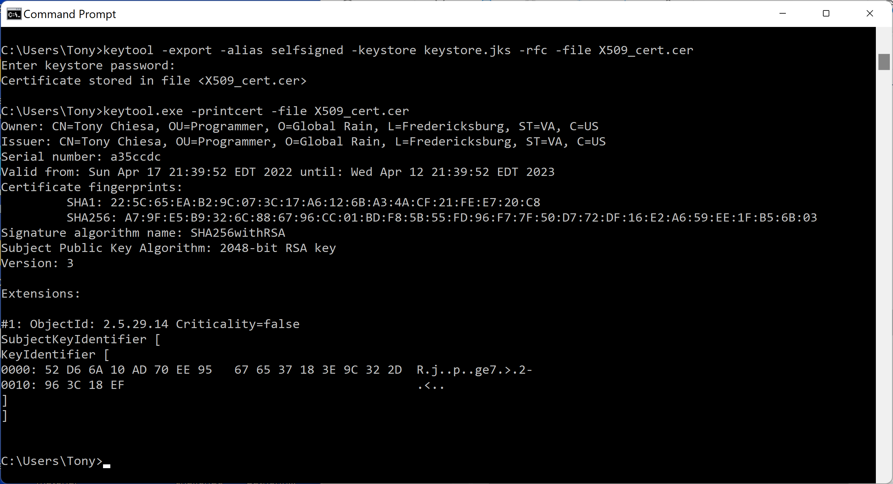
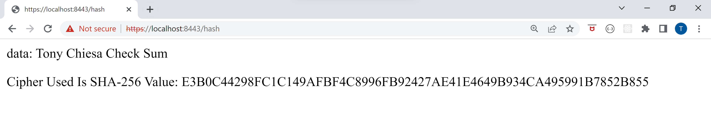
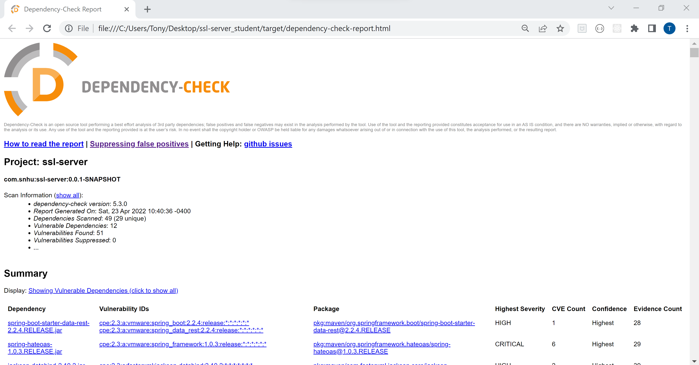

# Artemis-Financial

## About
Artemis Financial is a financial consulting company that develops individualized financial plans for savings, retirement, investments, and insurance for their patrons. As an important step in Artemis Financial’s desire to modernize its operations and as a crucial part of the success of their custom software, they want to implement and apply the most current and effective software security. Artemis Financial has a public web interface and is seeking expertise in taking steps to protect their client data and financial information.

## Motivation & Requirements
Artemis Financial is seeking to add a file verification step to their web application to ensure secure communications. When their web application is used to transfer data, they will need a data verification step in the form of a checksum. I have been asked to take their current software application and add secure communication mechanisms to meet their software security requirements. The final deliverable will be a production quality integrated application that includes secure coding protocols.

## Usage
This repo includes:

The code base for the project.

The Vulnerability Assessment Report inclueds Interpreting Client Needs, Areas of Security, Manual Review, Static Testing, and a Mitigation Plan.

The Practices for Secure Software Report includes the Algorithm Cipher, Certificate Generation, Deploy Cipher, Secure Communications, Secondary Testing, and Functional Testing.

## Screenshots

## Applying Skills Learned To Future Development Projects

Utilizing the vulnerability assessment allowed me to identify all the potential security risks. Using secure coding techniques is important because it ensures data integrity which gives confidence when using the data in a business environment. The overall value of software security to a company is that it keeps public trust, this is extremely important for a financial company like Artemis Financial. The assessment was helpful in identifying the vulnerable of the system, the challenge then became on determining which actions were required to close the vulnerabilities.Using a check sum verification process or another algorithmic approach creates a standard approach to the need for increased layers of security. Whether it’s using encryption, applying updates immediately, or multi-factor authentication, having a comprehensive and ongoing risk assessment process in the future will help determine which technique is required for any situation that arises. To ensure the code and software application were functional and secure I ran code with no errors and verified output to see if it was what was expected

## Summary
During this project I implemented a protected RestController to act as the secure controller for my program's hash RESTful stop. The ServerController class is responsible for matching the issues depicted in the vulnerability assessment diagram. I also selected to use the SHA-256 hashing cipher since it is incredibly safe and has a very low probability of collisions. Using the SHA-256 algorithm, the chance of a collision is 1 in 2^256. This is secure enough to be trusted by the United States Federal Government as the Department of Defense (DoD) industry standard. To maintain the application's existing security, in the future I would recommend scheduled dependency checks to stay up to speed on any vulnerabilities as well as an appropriate plan utilizing a continuous integration and continuous delivery tool like Jenkins, which would allow for security to be continuously checked at all levels of the lifecycle. 
